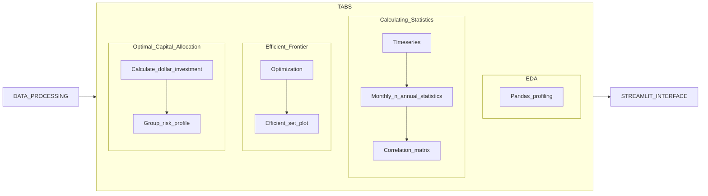

<h1>Asset Allocation Project</h1>
<h3>Folder structure:</h3>
```
|-- .streamlit|
|   |-- secrets.toml
|-- cfg|
|   |-- config.yml
|-- data
|   |-- processed
|       |-- processed_data.csv
|   |-- raw
|       |-- Project1-AssetAllocation-1980s_template.xlsx
|       |-- Project1-AssetAllocation-1990s_template.xlsx
|       |-- Project1-AssetAllocation-2000s_template.xlsx
|-- notebooks
|   |-- scratchpad.ipynb
|-- src
|   |-- data_processing
|       |-- processing_workflow.py
|   |-- util
|       |-- functions_by_tab
|           |-- tab1.py
|           |-- tab2.py
|           |-- tab3.py
|           |-- tab4.py
|           |-- tab5.py
|       |-- basic_utility.py
|       |-- latex_formula.py
|   |-- interface.py
|-- tests
|-- .gitignore
|-- .python-version
|-- poetry.lock
|-- pyproject.toml
|-- README.md
```
<h3> Simple Workflow Diagram </h3>


