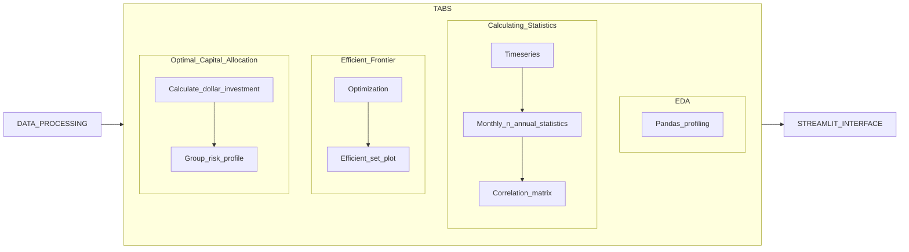

<h1>Asset Allocation Project</h1>

#### Simple Workflow Diagram:



#### Folder structure:
```
|-- .streamlit|
|   |-- secrets.toml
|-- cfg|
|   |-- config.yml
|-- data
|   |-- processed
|       |-- processed_data.csv
|       |-- optimization_excel.csv
|   |-- raw
|       |-- Project1-AssetAllocation-1980s_template.xlsx
|       |-- Project1-AssetAllocation-1990s_template.xlsx
|       |-- Project1-AssetAllocation-2000s_template.xlsx
|-- notebooks
|   |-- scratchpad.ipynb
|-- src
|   |-- data_processing
|       |-- processing_workflow.py
|   |-- util
|       |-- functions_by_tab
|           |-- tab1.py
|           |-- tab2.py
|           |-- tab3.py
|           |-- tab4.py
|           |-- tab5.py
|       |-- basic_utility.py
|       |-- latex_formula.py
|   |-- interface.py
|-- tests
|-- .gitignore
|-- .python-version
|-- poetry.lock
|-- pyproject.toml
|-- README.md
```
#### Configuring environment:
We will be using Pyenv + Poetry for environment & dependency management in this project

(1) Managing Python versions using Pyenv:
  - Version manager that helps you to manage different versions of Python based on project needs
  - Unfortunately, it doesn't work with windows. You will need WSL (a subsystem of Ubuntu within Windows) if you want to use Pyenv

```
# if you are using mac
brew install pyenv 

# if you are using linux
curl https://pyenv.run | bash 

# Or you can do it through the git clone way
git clone https://github.com/pyenv/pyenv.git ~/.pyenv
```
Adding Pyenv's path to .bashrc (linux) or .zshrc (mac)
```
# Run the following in terminal to add the path to .bashrc
echo 'export PYENV_ROOT="$HOME/.pyenv"' >> ~/.bashrc
echo 'command -v pyenv >/dev/null || export PATH="$PYENV_ROOT/bin:$PATH"' >> ~/.bashrc
echo 'eval "$(pyenv init -)"' >> ~/.bashrc

# Run the following in terminal to add the path to .zshrc
echo 'export PYENV_ROOT="$HOME/.pyenv"' >> ~/.zshrc
echo 'command -v pyenv >/dev/null || export PATH="$PYENV_ROOT/bin:$PATH"' >> ~/.zshrc
echo 'eval "$(pyenv init -)"' >> ~/.zshrc
```


(2) Use Poetry to ensure that this codebase is reproducible:
  - poetry can be installed using the following command in terminal if you are using mac/linux
    ```curl -sSL https://install.python-poetry.org | python3 -```
  - For windows(powersell):
    ```(Invoke-WebRequest -Uri https://install.python-poetry.org -UseBasicParsing).Content | py -```
  - Assume you already have a root folder of the project created
  - Call ```poetry init``` in terminal to instantiate a pyproject.toml, running ```poetry add [package]``` will create another poetry.lock file. 
  - Having these 2 files together and run ```poetry install``` after cloning the repository will ensure that someone else would be able to reproduce the environment and dependency of this project.

(3) Activating the environment:
- run ```poetry shell``` in the terminal

(4) Run the streamlit App:
```streamlit run ./src/interface.py```
